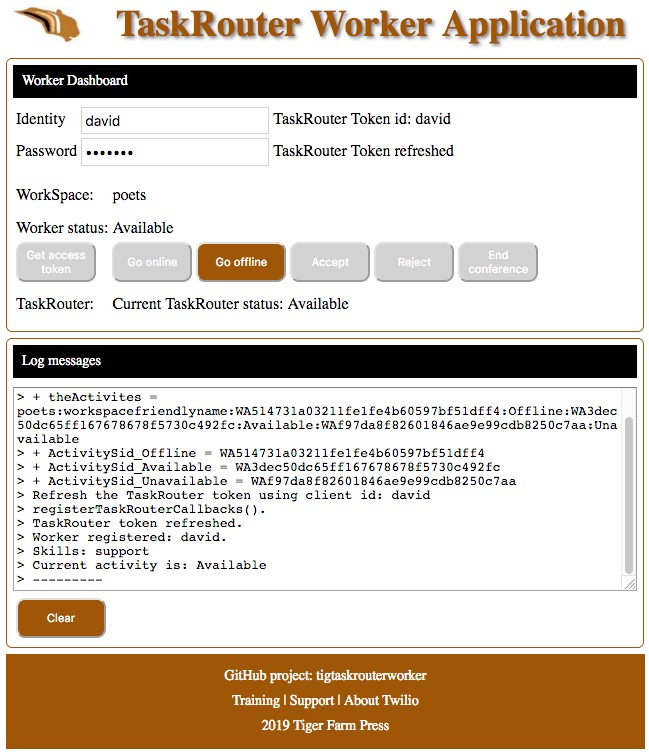
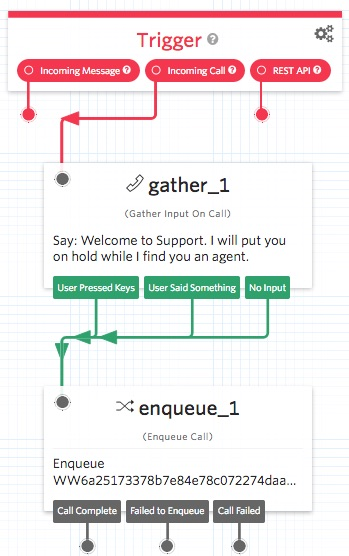
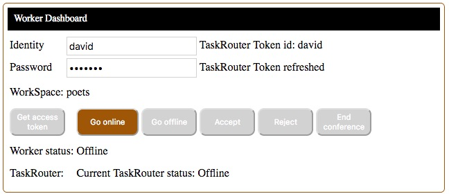

# TaskRouter Worker Application Version 3.2

This application is used by Twilio TaskRouter workers to 
manage their availability status, accept or reject reservation calls,
and end their reservation conference calls.

## Functionality

- Using their browser, the application allows workers to enter their identity and a password.
- Workers manage their status: available to take a call, busy while on a call, or unavailable.
- Status is displayed in the browser.
- Workers can accept or reject a call reservation.
- If a worker's reservation times out, the worker status is changed to unavailable.
- A worker can end a call which disconnects all participants from the reservation conference call.
- If a task is set to wrapping, it is automatically reset to completed. This avoids a worker not being able to reset their status.

Worker application screen print:

--------------------------------------------------------------------------------

## Steps to Implement a TaskRouter Workflow System

1. Configure your Twilio TaskRouter Workspace.
2. Create a Studio flow to put incoming callers into the TaskRouter queue.
3. Configure your Twilio phone number to use the Studio flow.
4. Deploy the TaskRouter Worker application and set the environment variables.
5. Test the application, test the system.

Click [here](https://www.loom.com/share/f7b6cb45e12a439aaaef05affb714acb) for a video of me walking through the steps.

#### Call Flow

With Twilio Studio and TaskRouter, in less than two hours, you can set up a call flow, which is the bases of a call center. 
This exercise will walk you through the steps to configure your Twilio phone number to receive calls and put them into a queue.
The callers will listen to music while TaskRouter arranges an agent to take their call.

When a caller is added into the queue, TaskRouter creates a reservation and then asks an agent if they will accept the call.
The agent has the option to Accept, and be connected with the caller; or to Reject the call.
If the call is rejected, TaskRouter will ask the next available agent.

Agents will use their web browser, on their computer, to manage their status: offline, or available to accept calls.
When they accept a call, TaskRouter will dial their TaskRouter worker phone number, to connect them to the caller.

The setup instructions are located at this GitHub repository URL:

https://github.com/tigerfarm/tigtaskrouterworker/blob/master/README.md

Implementation requirements:
- You will need a [Twilio account](http://twilio.com/console). A free Trial account will work for testing.
- You will need an [Heroku account](https://heroku.com/) to host your application. A free account version will work for testing.
- For testing, you will need at least 2 phone numbers; for example two mobile phone numbers: one to be the caller, the other phone number for the worker (agent).
- Developer skills are not required, as the sample application is functional, as is.

### Configure your TaskRouter Workspace

Go to the TaskRouter dashboard:
https://www.twilio.com/console/taskrouter/dashboard 

Create a Workspace, and set:
- Name: writers.

Create a Caller TaskQueue, and set:
- TaskQueue Name to: support.
- Max Reserved Workers: 1.
- Queue expression: skills HAS "support"

Create a Workflow, and set:
- Friendly Name: support.
- Assignment Callback, Task Reservation Timeout: 10.
- Default queue: support.

Create a Worker, and set:
- Name: charles.
- Attributes to: {"skills":["support"],"contact_uri":"+16505551111"}. Replace 16505551111, with your mobile phone number.

View Your TaskRouter Activities: Offline, Available, and Unavailable

### Create an IVR Studio Flow to Manage Incoming Calls

Go to the TaskRouter dashboard:
https://www.twilio.com/console/studio

Create a new flow, and set:
- Friendly name: Writers IVR.

Drag an Gather Input On Call widget onto the flow panel.
- Join Trigger Incoming Call to the Gather widget.
- Set the Text to Say to: "Welcome to Support. I will put you on hold while I find you an agent."
- Set "Stop gathering after" to 1 digit.

Drag an Enqueue Call widget onto the flow panel.
- Join the Gather widget to the Enqueue Call widget.
- Set the widget name to: enqueue_to_Support.
- Set, TaskRouter Workspace, to: writers.
- Set, TaskRouter Workflow, to: support.

### Configure your Twilio phone number to use the Studio flow.

In the Twilio Console, buy a phone number, if you don't already have one:
https://www.twilio.com/console/phone-numbers/search

In the phone number’s configuration page,
- Set Voice & Fax, A Call Comes In, to: Studio Flow / Writers IVR

Test, by using your mobile phone to call your IVR Twilio phone number.
- You will hear your Say welcome message.
- You will be put into the TaskRouter queue and hear the wait music.
- Disconnect/hangup the call. Your IVR is successfully tested.

### Deploy the TaskRouter Worker Application

This application is ready to run.
To deploy to Heroku, you will need an [Heroku account](https://heroku.com/) to host your application.
Once you have an account, stay logged in for the deployment and configuration.

Click the Deploy to Heroku link.

When you deploy to Heroku, you will be prompted for an app name. 
The name needs to be unique. Example, enter your name+tw (example: davidtw). 
Click Deploy app. Once the application is deployed, click Manage app. 
Now, set the Heroku project environment variables by clicking Settings. 
Click Reveal Config Vars.

Add the following key value pairs:
- ACCOUNT_SID : your Twilio account SID (starts with "AC", available from Twilio Console)
- AUTH_TOKEN : your Twilio account auth token (Available from Twilio Console, click view)
- TOKEN_PASSWORD : your token password (Password is required to create tokens. The password can be any string you want to use.)
- WORKSPACE_SID : your TaskRouter workspace SID

Note, if you need to redeploy and keep the same Heroku URL, then remove the old app.
- From the [Heroku dashboard](https://dashboard.heroku.com), select the app which is to be removed.
- Click Settings. Go to the bottom and click Delete app.
- Then, redeploy the app by click the GitHub Deploy to Heroku button. And, re-enter the Config Vars.

### Test the Application, Test the System

In your browser, go to your TaskRouter Workers Application.
- WorkSpace name is displayed: writers.
- Enter your worker name: charles.
- Enter your token password.
- Click Get access token. Worker status is displayed: Offline.
- Click Go online. Worker status is displayed: Available.
- Click Go offline, and Go online, which is how you set your availability status.
- Click Go online,to be available for a call reservation.

Call your IVR Twilio phone number, and you will be put into the TaskRouter queue.
- In your TaskRouter Workers Application, Accept and Reject options are highlighted.

- Click Accept. Your phone will ring, and, End conference will be highlighted because the call is a conference call.
- Answer your phone, and you are connected to the caller.
- Click End conference, and both you (the TaskRouter worker) and the caller are disconnected from the conference; the conference is ended.

You now have a working and tested TaskRouter implementation.

Next steps:
- Add more workers.
- Add a sales TaskRouter queue (skills HAS "sales") and Workflow.
- Add sales workers ({"skills":["sales"],"contact_uri":"+16505552222"}).
- Add sales as an IVR option in the Studio flow. This will require adding a Split widget and another Enqueue Call widget. Click [here](https://www.twilio.com/docs/studio#get-started-with-twilio-studio) for a sample flow with a Split widget.
- Handle the case where no workers are available and the Workflow times out. Create and test a [Studio voicemail](https://www.twilio.com/docs/studio/widget-library#record-voicemail) flow. Link it into your Workflow timeout option.
- Add business hours to your IVR. If a caller calls outside of the [business hours](https://www.twilio.com/blog/2018/06/custom-javascript-twilio-functions-code-studio-flows.html), put them straight into voicemail.
- Implement a Twilio Client so that agents can receive calls on their laptop. Click [here](https://github.com/tigerfarm/OwlClient) for my sample Twilio Client which has more features such as putting callers on hold.

--------------------------------------------------------------------------------

## Documentation for Developers

### Local host Implementation using the included NodeJS HTTP Webserver

Notes, the Twilio Node.JS helper library is not required.
The server side can run locally on a computer using NodeJS, or run on a website that runs PHP programs.

Download the project zip file.

https://github.com/tigerfarm/tigtaskrouterworker

1. Click Clone or Download. Click Download ZIP.
2. Unzip the file into a work directory.
3. Change into the unzipped directory.

Install the NodeJS "request" module:
    
    $ npm install request

Run the NodeJS HTTP server.

    $ node nodeHttpServer.js
    +++ Start: nodeHttpServer.js
    Static file server running at
      => http://localhost:8000/
    CTRL + C to shutdown
    ...
    
Use a browser to access the application:

http://localhost:8000/index.html
    
#### Server side Application Programs

The programs are called from the browser application using Ajax.

getTrActivites.php : When initializing the browser side client, get the WorkSpace friendly name and the TaskRouter activities.

generateTrToken.php?tokenPassword= + tokenPassword + &clientid= + clientId : given a client identity and the password, generate a token.

conferenceEndFn.php?conferenceName= + theConference : given a conference SID, end the conference.

taskReservationTaskFix.php?taskSid= + taskSid : given a task SID, if the status is wrapping, change it to completed.

#### Utility Programs

conferenceListInProgress.php : List conferences that are in progress.

taskDeleteAll.php : remove all tasks.

taskReservationList.php : List task information.

taskReservationListFix.php : List task information and, if the status is wrapping, change it to completed.

workerStatus.js : Node.js program to list the status of all the WorkSpace workers.

nodeHttpServer.js : Node.js web server program for testing this application on a local host.

--------------------------------------------------------------------------------

Cheers...
